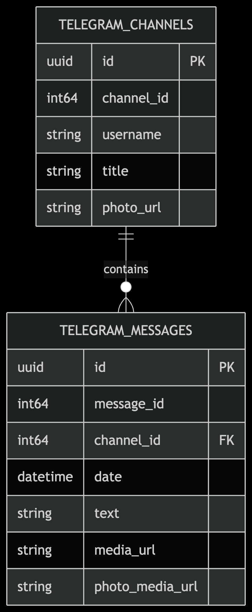
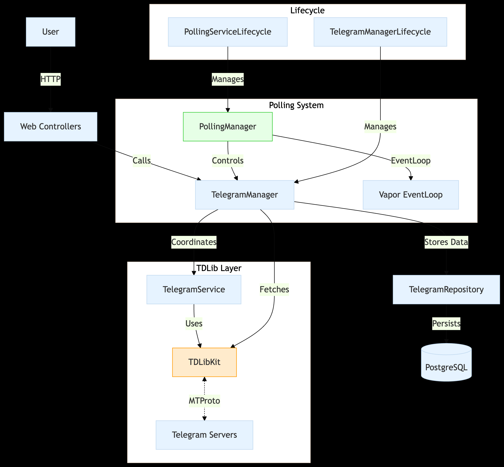
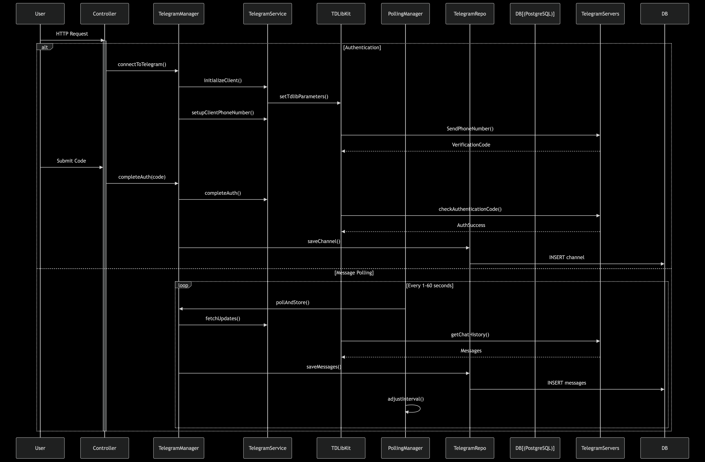
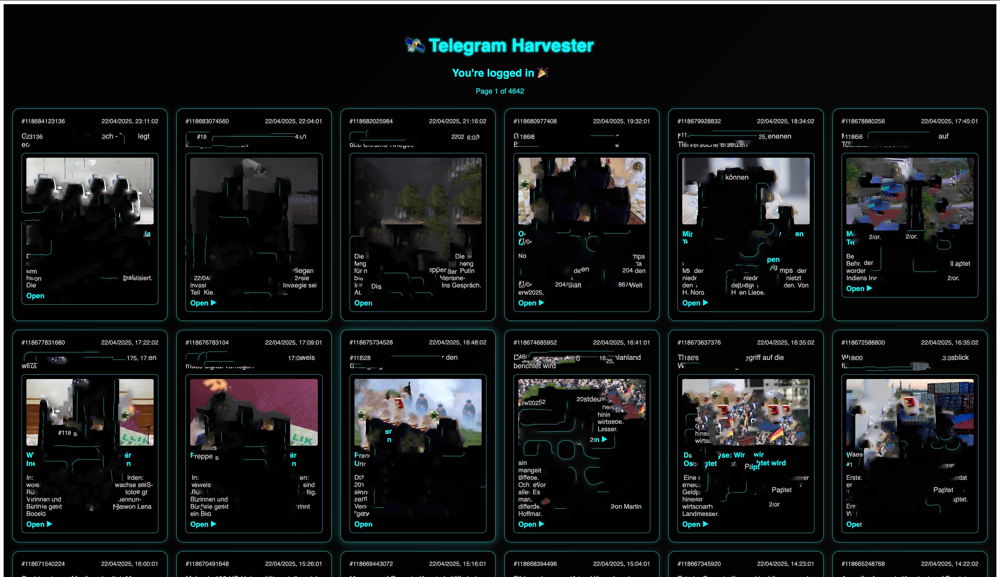
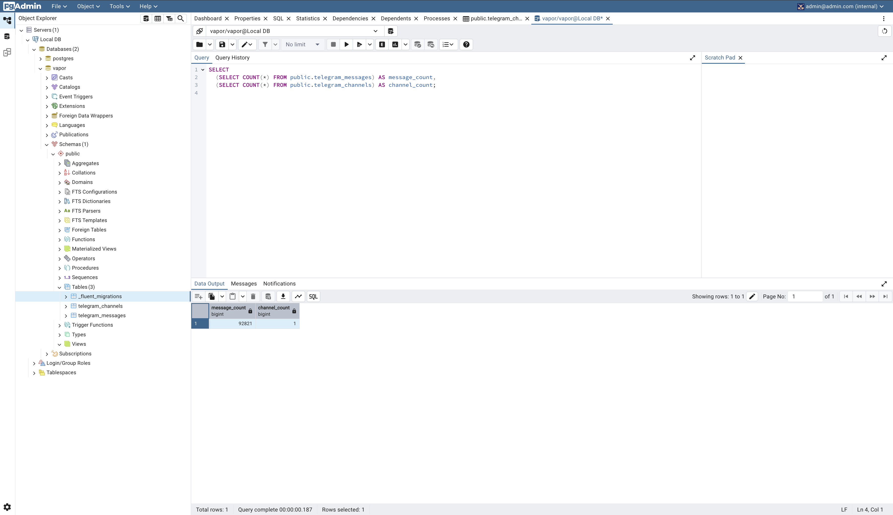

# Telegram Harvester (Swift)

A Swift (Vapor) backend service for harvesting and managing messages from a public Telegram channel. It uses TDLib for Telegram API integration, supports adaptive polling based on message activity, and exposes messages via a simple REST API and frontend.

> ⚠️ **Note:** This tool is for educational and non-commercial use. Always ensure your usage complies with Telegram’s [Terms of Service](https://telegram.org/tos) and local data protection laws.

## 🧠 What This Project Does

- Connects to the public Telegram channel: [https://t.me/tagesschau24](https://t.me/tagesschau24)
- Fetches and stores messages in a database (PostgreSQL)
- Implements adaptive polling to balance efficiency and responsiveness
- Exposes a REST API to fetch messages with pagination
- Offers a minimal frontend UI for interaction

---

## ✅ About the project

- **Clear, working code** ✔️
    - The code is structured into logical components (e.g., `TelegramService`, `PollingManager`, `TelegramManager`, `AuthController`, etc.).
  - Each component has a clear responsibility, and the methods are concise and focused.
  - The adaptive polling strategy and REST endpoints appear functional and well-integrated.

- **Thoughtful structure and naming** ✔️
  - The project is organized into directories like `Controllers`, `Managers`, `Services`, `Repositories`, and `Models`, which follow a clean separation of concerns.  
  - Class and method names (e.g., `PollingManager`, `doPoll`, `completeAuth`) are descriptive and align with their functionality.  
  - The use of `TelegramManager` and `PollingManager` ensures that responsibilities are distributed logically.

- **Good balance of simplicity and flexibility** ✔️
  - The code is simple enough to understand while being flexible for future enhancements.
  - Adaptive polling ensures efficient resource usage, making the system scalable for both low and high message activity.
  - Pagination in the REST endpoints allows handling large datasets without overwhelming the client or server.

- **Comments/docs explaining key decisions** ✔️
  - Key decisions, such as adaptive polling and error handling, are explained in comments.
  - Example:
    - **PollingManager**: Comments explain how polling frequency is adjusted based on message activity.
    - **TelegramManager**: Comments describe the authentication flow and how channel information is saved.
    - **HomeController** and **MessageController** include comments about their purpose and functionality.
    - etc..
- **Approach to scheduling, error handling, and scaling** ✔️
  - **Scheduling**:
    - Adaptive polling is implemented in **PollingManager**, with dynamic interval adjustments based on message activity.
    - The `scheduleNext` method ensures efficient scheduling of polling tasks.

  - **Error Handling**:
    - Errors are logged using `logger.error`, and meaningful messages are provided for debugging.
    - Example: **PollingManager** gracefully handles errors during polling and retries after a delay.

  - **Scaling**:
    - Pagination in **MessageController** ensures the system can handle large datasets.
    - The use of a database (e.g., SQLite) allows for efficient storage and retrieval of messages, with the flexibility to switch to a more scalable database if needed.

---

## 📁 Project Structure

```
TelegramHarvester
├── Sources
│   ├── TelegramHarvester
│       ├── Controllers
│       │   ├── AuthController.swift
│       │   ├── HomeController.swift
│       │   ├── MessageController.swift
│       ├── Managers
│       │   ├── TelegramManager.swift
│       │   ├── PollingManager.swift
│       ├── Models
│       │   ├── TelegramMessage.swift
│       │   ├── TelegramChannel.swift
│       ├── Repositories
│       │   ├── TelegramRepository.swift
│       ├── Services
│       │   ├── TelegramService.swift
│       ├── routes.swift
│       ├── configure.swift
├── Public
│   ├── index.html
│   ├── js
│       ├── app.js
├── Package.swift
```

---


## Prerequisites:
- **Vapor**: Make sure you have Vapor installed. You can follow the official [Vapor Installation Guide](https://vapor.codes) if you haven't done so already.
- **Docker**: You need Docker installed to run the PostgreSQL and pgAdmin containers. You can download Docker from [here](https://www.docker.com/get-started).

####  🐳 Docker Setup: Running PostgreSQL and pgAdmin

To use PostgreSQL for storing data and pgAdmin for managing the database, run the following Docker commands:

####  ✅ Run PostgreSQL in a Docker container

```bash
    docker run --name postgres-vapor \
    -e POSTGRES_USER=vapor \
    -e POSTGRES_PASSWORD=vapor \
    -e POSTGRES_DB=vapor \
    -p 5432:5432 \
    -v pgdata:/var/lib/postgresql/data \
    -d postgres:15

    docker run --name pgadmin \
    -p 5050:80 \
    -e PGADMIN_DEFAULT_EMAIL=admin@admin.com \
    -e PGADMIN_DEFAULT_PASSWORD=admin \
    -d dpage/pgadmin4

  ```
## Steps to Set Up the Project:

1. **Clone the repository**
   Clone the repository to your local machine:
```bash
   git clone https://github.com/NajyFannoun/TelegramHarvester-Vapor.git
   cd TelegramHarvester
```

2. **Create a `.env` file**

   Create a `.env` file in the project root directory and add the following content:

```env
   DATABASE_HOST=localhost
   DATABASE_PORT=5432
   DATABASE_USERNAME=vapor
   DATABASE_PASSWORD=vapor
   DATABASE_NAME=vapor

   TELEGRAM_API_ID=XXXXXXXXX
   TELEGRAM_API_HASH=XXXXXXXXXXXXXXXXXXXXXXXXXXXXXX
   TELEGRAM_PHONE_NUMBER=+49XXXXXXXXXXX
   TELEGRAM_AUTH_CODE=XXXXX

   TELEGRAM_CHANNEL_USERNAME=@tagesschau24
```

3. **Build the project**
   To build the project, run the following command:
```bash
   swift build
```

4. **Run the service**
```bash
    swift run 
```

5. **Open in browser**
```bash
    http://localhost:8080
```

6. **Trigger Database Migration**
```bash
    GET http://localhost:8080/migrate-database
```
This endpoint will create necessary database tables using Vapor's auto-migration feature.

7. **Authenticate with Telegram**
After adding your Telegram phone number and API credentials (`TELEGRAM_API_ID`, `TELEGRAM_API_HASH`) to your config (`.env`):

You will receive a message on Telegram with a login code. Once received, visit:
```bash
    GET http://localhost:8080/auth/code?code=123456
```
Replace `123456` with the code sent to your Telegram.

---

## 🔍 REST API

Available API endpoints in the Telegram Harvester backend.

---

### AuthController

| **HTTP Method** | **Endpoint**             | **Description**                                                              |
|----------------|---------------------------|------------------------------------------------------------------------------|
| `GET`          | `/auth/code?code=123456` | Completes Telegram authentication using the provided 6-digit code.          |
| `GET`          | `/auth/status`           | Returns the current authentication status of the Telegram client.           |

---

### ChannelController

| **HTTP Method** | **Endpoint**               | **Description**                                                                 |
|----------------|-----------------------------|---------------------------------------------------------------------------------|
| `GET`          | `/channel/:channelId`      | Fetches metadata/details for a specific Telegram channel by its ID.            |
| `GET`          | `/messages/:channelId`     | Retrieves the latest 20 messages from the specified channel, with channel info.|

---

### MessageController

| **HTTP Method** | **Endpoint**      | **Description**                                                                 |
|----------------|--------------------|---------------------------------------------------------------------------------|
| `GET`          | `/messages?page=1&per_page=20`       | Returns paginated messages. Supports `page` and `per_page` query parameters.   |

---

### MigrationController

| **HTTP Method** | **Endpoint**            | **Description**                                                                 |
|----------------|--------------------------|---------------------------------------------------------------------------------|
| `GET`          | `/migrate-database`     | Triggers database schema migration and returns success/failure status.         |

---

### HomeController

| **HTTP Method** | **Endpoint** | **Description**                                                                |
|----------------|--------------|--------------------------------------------------------------------------------|
| `GET`          | `/`          | Serves the `index.html` file for the frontend (root route).                    |
| `GET`          | `/*`         | Wildcard route that serves `index.html` for client-side routing (React SPA).   |

---

## 🖼️ Screenshots

### Diagrams


<p align="center">
  <strong>Database Schema</strong><br>
  
</p>

<p align="center">
  <strong>Complete System Architecture</strong><br>
  
</p>

<p align="center">
  <strong>Data Flow Sequence Diagram</strong><br>
  
</p>


### UI Preview

<p align="center">
  <strong>LoginPage</strong><br>
  
</p>


<p align="center">
  <strong>Main Page (blurred for copyright 🚧)</strong><br>
  
</p>


<p align="center">
  <strong>PgAdmin</strong><br>
  
</p>


---

## 📦 Tech Stack

- Swift (Vapor)
- Telegram TDLib (via Swift bindings)
- PostgreSQL
- HTML + JS frontend

---

---

## 🧪 Suggestions for Improvement

---

## 🧪 Suggestions for Improvement

- **Add Unit Tests for Critical Components**  
  Test core logic such as `TelegramService`, `PollingManager`, and `MessageController`.  
  _Example: Verify adaptive polling adjusts correctly based on message activity._

- **Expand UI for Better UX**  
  Enhance the frontend in `index.html` and `app.js` with loading indicators, error handling, and a more polished layout.

- **Add Dockerfile for Containerized Deployment**  
  Containerize the application using Docker to simplify deployment and scaling.

- **Improve Backend Architecture**  
  The current structure follows a clean separation of concerns, but it can evolve based on feedback or as the system scales.

- **🚧 Prevent Abuse & Encourage Responsible Usage**  
Apply rate limiting, secure authentication, and collect only public data to ensure safe and lawful usage.

---

## 🧔 Author

Najy Fannoun  

💧 A project built with the Vapor web framework.


## 🚧 Legal Disclaimer:
This service is for educational purposes only. By using it, you agree to comply with all applicable laws, including data privacy regulations in your jurisdiction, and assume responsibility for any legal risks involve